<!-- Ash nazg durbatulûk, ash nazg gimbatul, ash nazg thrakatulûk agh burzum-ishi krimpatul. -->
<!-- (One Pipeline to rule them all, One Pipeline to find them, One Pipeline to bring them all, and in the darkness `git bind` them.) -->

<div align="center">


# BARAD-DÛR

***the Eye is open · the watch holds***

**A mission-control tower for a legion of coding agents — they investigate, plan, implement,
review and ship real work in your repositories, while you sit on the dark throne and approve.**

[](https://rubyonrails.org)
[](https://www.ruby-lang.org)
[](https://www.postgresql.org)
[](https://docs.docker.com/compose/)
[](https://claude.com/claude-code)
[](#-the-trials)
[](LICENSE)

[The Tower](#-what-rises-here) • [The Palantír](#-gaze-into-the-palantír) • [Speak, Friend, and Enter](#-speak-friend-and-enter) • [The Legion](#%EF%B8%8F-the-legion) • [The Forging](#-how-the-work-is-forged) • [Inside the Tower](#-inside-the-tower) • [Words of Command](#-words-of-command)

</div>

---

<div align="center">

### 📖 &nbsp;Start here

|  |  |
|:--|:--|
| **[▶ &nbsp;How It Works](docs/HOW-IT-WORKS.md)** | **The complete guide, in plain English.** What this is, why it exists, every feature it has, and where to use it — with diagrams and a worked example. No technical knowledge assumed. |
| **[⚡ &nbsp;Quick Start](docs/QUICKSTART.md)** | **From nothing to a running pipeline in ten minutes.** Everything you need installed, every step, and what to do when it misbehaves. |

</div>

---

## 🗼 What rises here

Barad-dûr is a self-hosted web app that runs a **complete software development lifecycle on autopilot** —
with you as the Lidless Eye atop it. Describe a feature in plain speech, and the tower:

1. **Investigates** your actual repositories (read-only — Scouts do not touch, only see),
2. **Asks** the questions it will not guess at (clarifications become blocking *SUMMONS*),
3. **Plans** an ordered ticket campaign with dependencies and acceptance criteria,
4. **Implements** on `pipe/*` branches with real commits — never on your default branch,
5. **Reviews, tests**, and finally waits at the gates of your judgment:
   **Approve & merge**, or hurl the work back whence it came with feedback.

Every agent is a real headless [Claude Code](https://claude.com/claude-code) session. Every diff is a real diff.
Every dollar of **Tribute burned** is real spend, capped daily — the tower pauses itself before it beggars you.
Every charge is a ledger row, so *cost per shipped ticket*, *cost by phase* and *cost by model* are facts rather than estimates.

> *"It needs but one Eye to command a legion."* — the Setup Wizard, step 5 of 5, probably

## 🔮 Gaze into the palantír

| Barad-dûr 🔥 | Minas Morgul 🌙 |
|:---:|:---:|
| 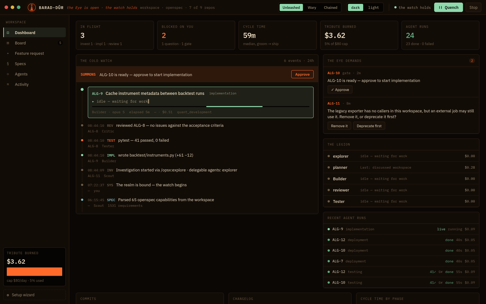 | 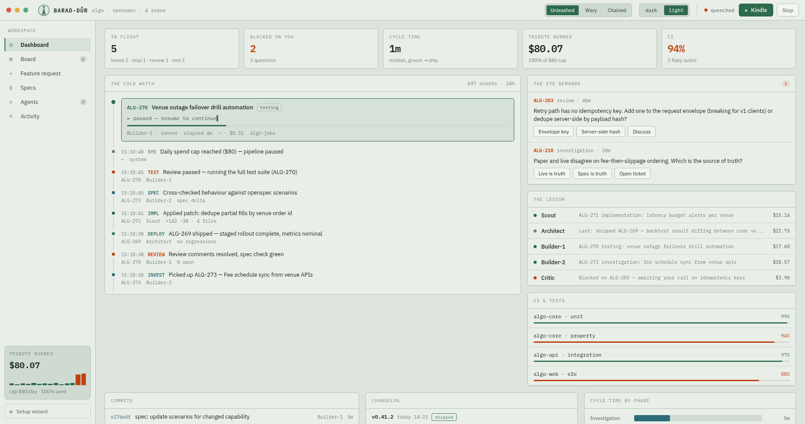 |

*Left: ember and shadow, as the Dark Lord intended. Right: once Minas Ithil, Tower of the Moon —
the same watch kept in corpse-pale witchlight. The Witch-king uses light mode. Draw your own conclusions.*

### The board — where the work marches

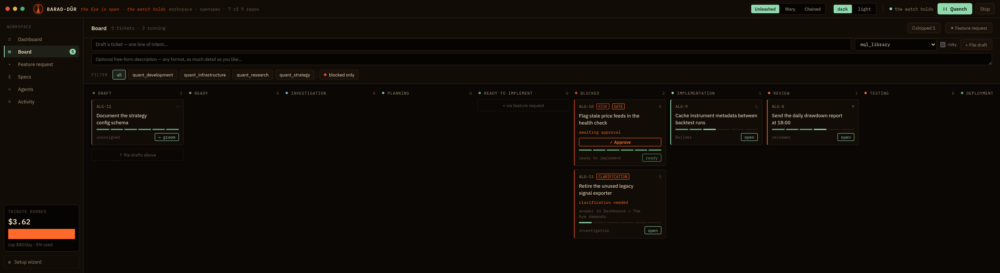

*Ten columns from Draft to Done. **Blocked** is derived, not a state: `ALG-10` waits on your
SUMMONS with an inline Approve, `ALG-11` waits on an answer, and both return to their real
column the moment you clear them. `ALG-9` is being written as you watch.*

### The drawer — everything about one ticket

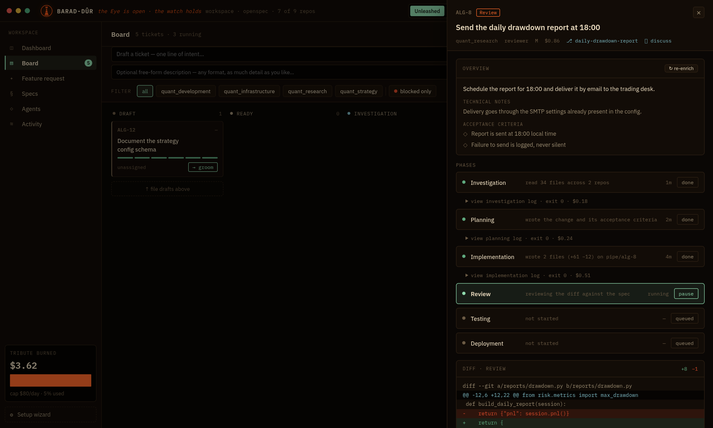

*Plain-language summary, technical notes, acceptance criteria, every phase with its own log,
exit code and cost, the real diff, and the three verdicts you may pass:
**Approve & merge**, **Request changes**, or **Push & PR**.*

### Feature request — one sentence in, a campaign out

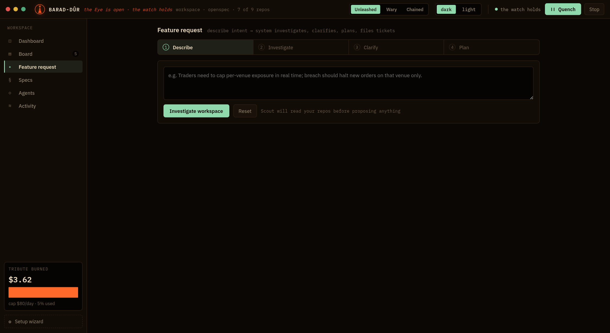

*Describe → investigate → clarify → plan → push to the board. The agent's narration streams
live; its questions block until answered.*

<table>
<tr>
<td width="50%"><b>Activity — the palantír</b><br><br>
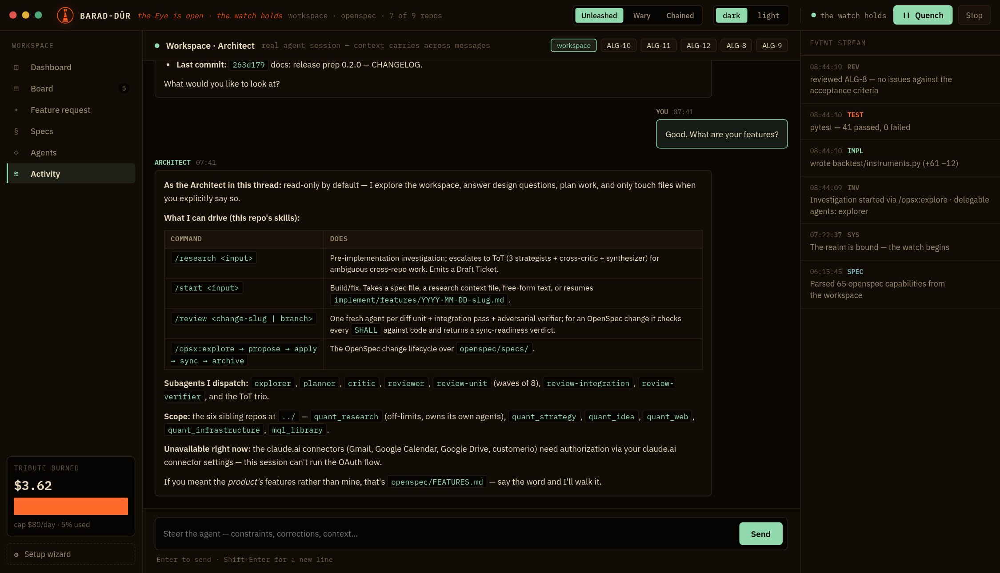<br>
<i>A real resumable session per ticket and one for the realm. It remembers the whole thread;
replies render as proper markdown.</i></td>
<td width="50%"><b>Specs — what the realm promises</b><br><br>
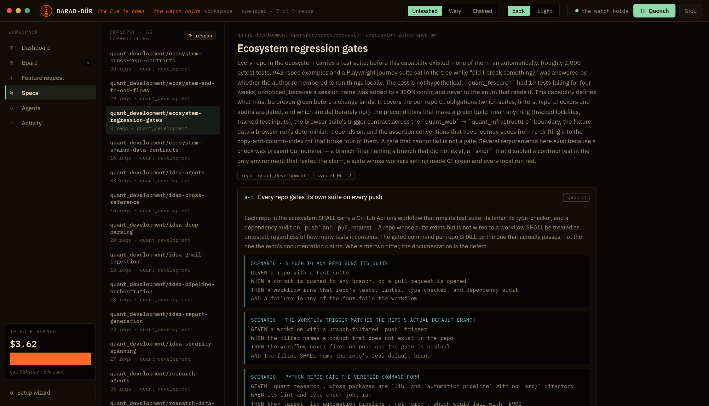<br>
<i>Your written specifications, indexed. Agents are held to them.</i></td>
</tr>
<tr>
<td width="50%"><b>The Legion — your roster</b><br><br>
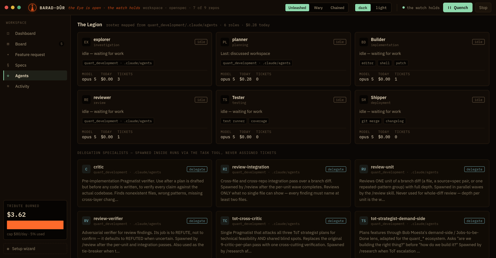<br>
<i>One agent per phase, taken from your own harness where it matches, built-ins elsewhere.</i></td>
<td width="50%"><b>The binding — five steps, once</b><br><br>
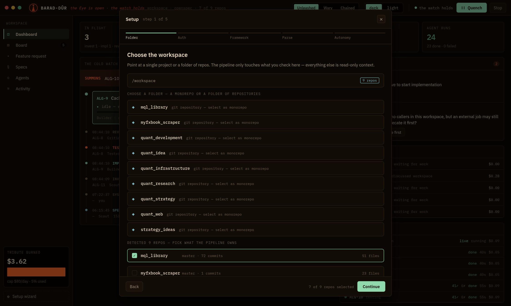<br>
<i>Folder, auth, framework, specs, autonomy. Then the watch begins.</i></td>
</tr>
</table>

**What you're seeing** — in the Common Tongue:

| In the Black Speech | In Westron (what it actually is) |
|---|---|
| **The Cold Watch** | Live event feed — every agent thought, tool call and phase change, streamed |
| **The Eye demands** | Your action center: clarifying questions, approval gates, failed runs to retry |
| **The Legion** | The agent roster — auto-mapped from your repo's own `.claude/agents` harness |
| **SUMMONS** | An approval gate. Nothing risky moves until you say so |
| **Tribute burned** | Real spend today, hourly bars, hard daily cap — every charge is a ledger row |
| **The reckoning** | Unit economics: cost per shipped ticket, first-pass rate, and how much of the elapsed time waited on you |
| **Unleashed / Wary / Chained** | Autonomy modes: full auto → gate risky things → gate everything |
| **Quench / Kindle** | Pause / start. The forge answers to you alone |
| **Settings** | Per-realm switches: how work lands, which phases run, model, cap, autonomy |

## 🚪 Speak, friend, and enter

The doors of Barad-dûr open considerably easier than the doors of Durin — no Elvish riddle required.
*(For the unhurried version, with prerequisites and troubleshooting, read the
**[Quick Start](docs/QUICKSTART.md)**.)*

```bash
git clone git@github.com:bl0rch1d/barad_dur.git && cd barad_dur
docker compose up
```

Then walk into **http://localhost:3000**. You arrive at an *unbound realm* — every page stands
empty but watchful, each with its own counsel (the board notes that *even Sauron cannot
micromanage an empty land*). One button leads onward: **Bind the realm — Setup wizard**.

### Binding it to your own lands

```bash
# mount a folder of repos (multi-repo) or a single repo (monorepo)
WORKSPACE_PATH=~/dev docker compose up
```

Auth is chosen in the wizard — **Claude subscription is the default** (your host's `~/.claude`
login is mounted in automatically; no per-token billing), or set `ANTHROPIC_API_KEY` for metered use.
The runner passes only the chosen credential to agents, so the two never cross streams.

Walk the Setup Wizard (five steps, one tower):

1. **Folder** — browse the mount, pick monorepo or multi-repo, check what the pipeline may own
2. **Auth** — subscription or key, plus the orchestrator model (Opus 5 rules them all by default)
3. **Framework** — your own agentic harness is auto-detected: commands in `.claude/commands`
   map onto phases (`/opsx:explore` → investigation, `/opsx:propose` → planning, `/opsx:apply` → implementation, `/review` → review).
   Carrying more than one? Pick which directory rules them — any repo, a monorepo package,
   or the workspace root
4. **Parse** — your `openspec/` specs are indexed with a progress bar that does not lie
5. **Autonomy** — pick your leash (*Unleashed*, *Wary*, or *Chained*) and **start the watch**

> **One does not simply merge into master.** Work lands via `--no-ff` merge commits from `pipe/*`
> branches, only after review, only local, and only when you press the button. The tower never pushes.

## ⚔️ The Legion

If a repo in your workspace carries a `.claude/agents/` folder, its **own agents** take the phases
they match; built-ins fill the gaps. The rest muster as **delegation specialists** — spawned inside
runs via the Task tool, never assigned tickets of their own.

| Phase | Who answers the summons | Lineage |
|---|---|---|
| Investigation | `explorer` | your harness |
| Planning | `planner` | your harness |
| Implementation | `Builder` | built-in |
| Review | `reviewer` (+ a verifier wave) | your harness |
| Testing | `Tester` | built-in |
| Deployment | `Shipper` | built-in |

No harness? The default seven serve faithfully. They are not evil, merely… *ambitious*.

## 🔥 How the work is forged

```
      draft ──groom──▶ ready ──▶ investigation ──▶ planning ──▶ ready to implement
                                      │                │                │
                                  questions?       openspec         SUMMONS?
                                 (Eye demands)      change            (gate)
                                                                        │
                              done ◀── deployment ◀── testing ◀── review ◀── implementation
                               │                                    │            (pipe/* branch,
                            merged by                        Approve & merge      real commits)
                            your hand                       or Request changes
```

- **Feature requests** run your harness end-to-end: `/opsx:explore` investigates, surfaces
  clarifying questions, `/opsx:propose` writes the change artifacts and files dependency-ordered
  tickets — which land *ready to implement*, because re-planning planned work is for goblins.
- **Blocked** is a derived column with subtypes (clarification / dependency / gate / failed) —
  tickets return to their place the moment the blocker falls.
- **Nothing ships without you.** Deployment is off by default, so work stops after the last
  enabled phase, opens a pull request, and waits on a SUMMONS. Approving merges the PR.
  Change any of it on the **Settings** screen — it belongs to the bound realm, not the image.
- **Dependencies are law**: nothing starts before what it awaits is done; the web and the ticker
  contend for tickets under row locks, so no two Nazgûl claim the same prey.
- **The palantír chat** (Activity) holds a real resumable agent session per ticket plus one for
  the whole realm — steer mid-flight; the session remembers, as palantíri do. Use responsibly.
- Restart-proof: orphaned runs surface as *failed, retryable*; seeds never trample a live realm;
  the favicon grows a burning badge when the Eye demands your presence in another tab.

## 🏗 Inside the tower

*The plain-English tour lives in [How It Works](docs/HOW-IT-WORKS.md). What follows is the
machinery beneath it.*

### What runs where

Three containers, one image. The **ticker** exists because a web request must never be the
thing that advances a pipeline — it enqueues a tick every few seconds and lets the engine
decide what, if anything, deserves to run.

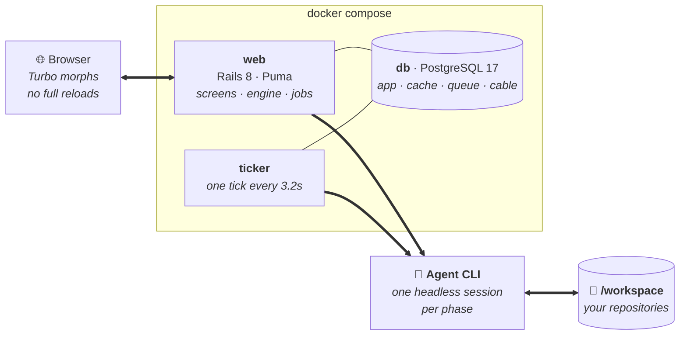

*Solid arrows carry HTTP and WebSocket traffic; the thick ones spawn agents. Both the web
process and the ticker can start a run — which is why pickups are row-locked.*

No Node, no Redis, no separate job server: importmap ships the JavaScript, and Solid
Queue/Cache/Cable all live in Postgres.

### One phase, end to end

Every stage of every ticket follows this path. The engine holds a **row lock** while
claiming a ticket, which is what stops the web process and the ticker from both waking the
same Nazgûl.

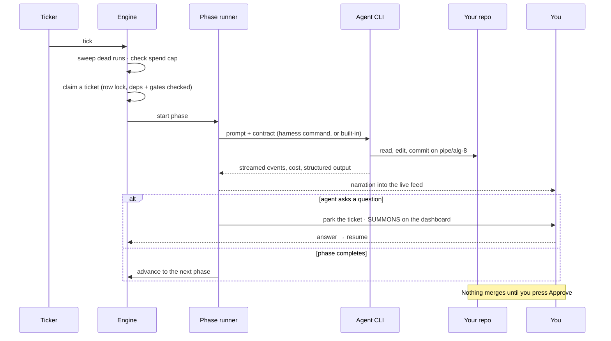

### How your own harness takes over

If a selected repository carries its own command definitions, they replace the built-in
prompts phase by phase. Anything unmatched quietly falls back — you never have to fill in
the gaps.

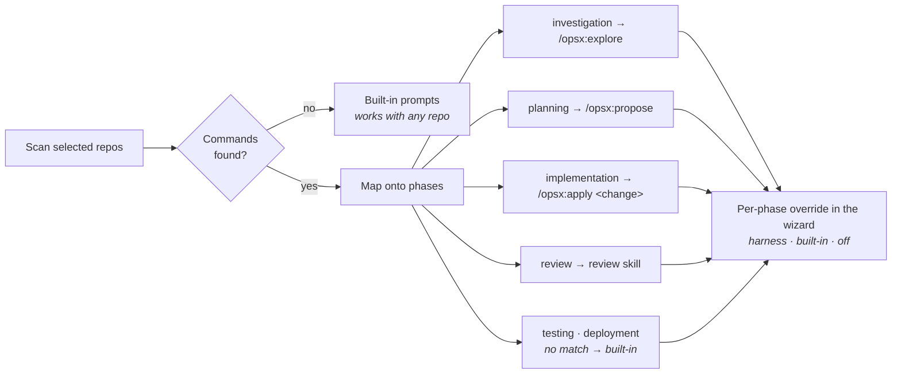

Detection is cached with the repo selection in the key, so ticking a repository in the
wizard re-detects immediately — and an **unselected** repo can never supply the harness.

### The shape of it

| Layer | What's there |
|---|---|
| **Engine** | `PipelineEngine` — the only thing that moves tickets; sweeps, gates, spend cap, row-locked pickups |
| **Runners** | `ClaudeCodeRunner` per phase, `HeadlessAgent` as the single one-shot CLI seam, structured output parsed from fenced JSON |
| **Workspace** | `Workspace` scans and caches the mount; `Harness` detects your commands; `SpecSync` indexes specs |
| **Jobs** | phase runs, feature-request investigate/plan, chat replies, enrichment, archive, push & PR |
| **Screens** | six controllers, ERB + Stimulus; live updates by Turbo morph, event feed by targeted stream |

## 📜 Words of Command

Speak them before `docker compose up`, or inscribe them once in a `.env` file. Both
services read `.env` into their own environment on start, so anything written there
reaches the running app — and if no `.env` exists, one is seeded from `.env.example`
automatically. It is gitignored, so your paths and keys never leave your machine.

| Rune | Effect | Default |
|---|---|---|
| `WORKSPACE_PATH` | Host folder mounted as the realm | `./workspace` |
| `ANTHROPIC_API_KEY` | Metered auth (wizard: "API key") | — |
| `CLAUDE_CONFIG_PATH` | Subscription login mount | `~/.claude` |
| `PIPELINE_RUNNER` | `auto` · `off` (kill-switch) | `auto` |
| `CLAUDE_MODEL` | Override the orchestrator model | wizard choice (Opus 5) |
| `CLAUDE_FLAGS` | Extra CLI flags for agent runs — agents may run shell commands in the selected repos so they can lint and test | `--permission-mode bypassPermissions` |
| `CLAUDE_MAX_TURNS` / `CLAUDE_TIMEOUT` | Patience of the tower — real planning work needs both | `120` / `2700s` |
| `PIPELINE_TICK_INTERVAL` | Heartbeat of the forge | `3.2s` |
| `DISABLE_RELOADING` | `1` = use mode: much faster renders, restart to pick up code edits | `0` |

## 🏰 Raising the tower elsewhere (production)

For towers that must stand outside one's own machine:

```bash
export RAILS_MASTER_KEY=$(cat config/master.key)
WORKSPACE_PATH=~/dev docker compose -f docker-compose.prod.yml up -d --build
```

Precompiled assets, jemalloc, Thruster, jobs inside Puma, the ticker as its
own service — and the same agent tooling (claude CLI, gh, git) baked into the
image. `PORT` picks the door (default 3000); `FORCE_SSL=1` when a
TLS-terminating proxy stands before the gate. The push & PR flow authenticates
via `GH_TOKEN`.

## 🔬 The Trials

```bash
docker compose exec web bin/rails test
# 101 runs, 545 assertions, 0 failures — passed in the fires of Mount Doom (a stub CLI;
# no tokens were sacrificed, the whole live path is hermetically testable)
```

## 🗺️ The Road Goes Ever On

- [x] Test-result capture — the testing phase's pass/fail counts, told truly on the dashboard
- [x] Push & PR flow — optional `gh` tribute to the far lands of GitHub, plus `/opsx:archive` after merge
- [x] Production deploy scrolls — for towers that must stand outside one's own machine
- [x] Everything else you can see. It took nine days. Make of that number what you will.
- [ ] Whatever the Eye desires next. Open an issue; the tower is listening.

## 🤝 Fellowship

Issues and pull requests are welcome — even from Elves.
Second breakfast is not provided but is respected.

## 🪶 Acknowledgments & License

Themed in tribute to Professor Tolkien; not affiliated with Middle-earth Enterprises.
**Sauron provided no code review** — all defects are the maintainer's own.

Released under the [MIT License](LICENSE). *It was ours, precious — now it is everyone's.*
Version history lives in the [CHANGELOG](CHANGELOG.md).

<div align="center">
<sub>No hobbits were harmed in the making of this pipeline. One (1) Balrog was mildly inconvenienced.</sub><br>
<sub><i>"Not all those who wander are lost — some are just watching the Cold Watch scroll."</i></sub>
</div>
