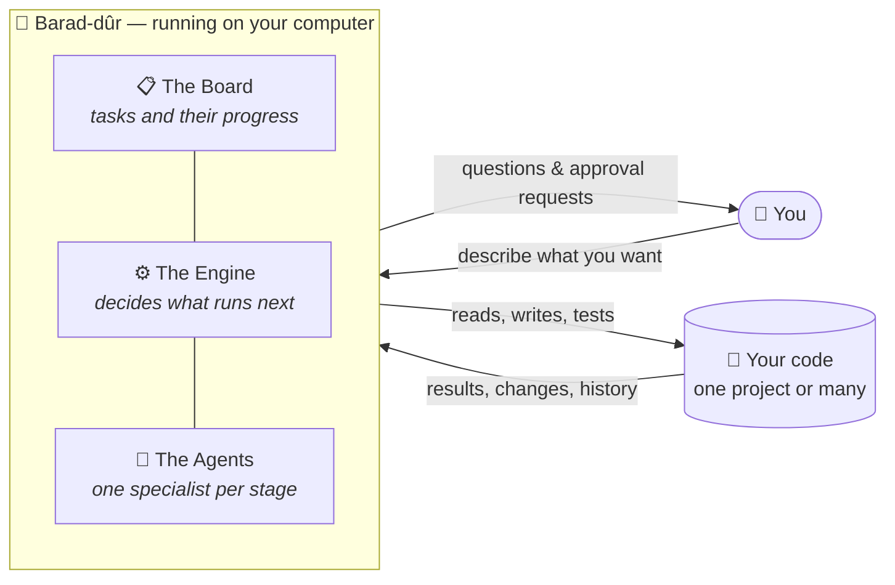
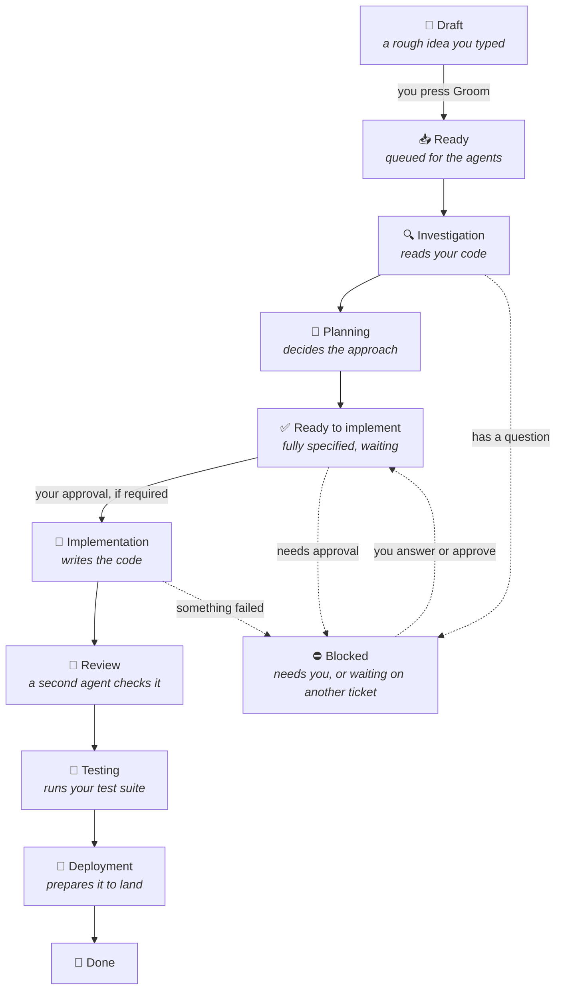

# How Barad-dûr Works

**A plain-English guide to what this thing is, why it exists, and what it can do.**

No programming knowledge required. If you can describe what you want built, you can
follow this document.

---

## In one minute

Barad-dûr is a **control room for AI coding assistants**.

You type a sentence like *"add a weekly summary email"*. From there the system runs the
whole professional software process on your behalf — it investigates your existing code,
asks you the questions it genuinely can't guess, writes a plan, breaks it into tasks,
writes the code, reviews it, runs the tests, and then stops and waits for you to approve
before anything is kept.

You watch it happen on a board, like a project tracker where the tickets move themselves.
Nothing reaches your main codebase until you press a button.

> **The short version:** an AI assistant is a talented contractor. Barad-dûr is the
> project manager, the process, and the paper trail around them.

---

## Why this needs to exist

AI coding assistants are genuinely good at writing code. The trouble is everything
*around* the writing.

| Working with a raw AI assistant | What goes wrong |
|---|---|
| You paste a request into a chat box | It starts coding immediately, guessing at anything ambiguous |
| It works in one long conversation | Close the window and the context is gone |
| It edits your files directly | Mistakes land in your real code with nothing to undo them cleanly |
| You supervise every step in real time | You are the bottleneck; you can't step away |
| Several requests at once | You lose track of what was asked, done, or half-finished |
| No record | Nobody can answer "why was this changed?" three weeks later |

Human software teams solved these problems decades ago, with a process: *investigate,
plan, build, review, test, ship* — with checkpoints where a person signs off.

**Barad-dûr applies that same process to AI assistants.** The discipline that makes human
teams reliable is what makes AI assistants reliable too.

What you get:

- **You describe, it decomposes.** One sentence becomes a properly scoped set of tasks.
- **It asks before it assumes.** Ambiguity becomes a question to you, not a guess.
- **Work is isolated.** Changes happen on a separate copy of your code until approved.
- **You can walk away.** It runs unattended and pauses when it genuinely needs you.
- **Everything is recorded.** Every decision, cost, and line changed is kept.
- **Spending is capped.** It stops itself before running up a bill.

---

## The big picture

Everything runs **on your own machine**. Your code never leaves it except to reach the AI
assistant, exactly as it would if you used that assistant directly.



Three things you point it at once, during a five-step setup:

1. **Your code** — a single project, or a folder containing many. You tick which ones the
   system is allowed to change; everything else it may read but never touch.
2. **Your AI account** — either an existing subscription or a pay-per-use key.
3. **How much freedom it has** — see [Staying in control](#staying-in-control).

---

## A real example, from sentence to shipped

Here is an actual run, start to finish, with what you see and what you do.

### 1. You ask for something

On the **Feature request** screen you type:

> *Traders need a daily drawdown report emailed at 6pm.*

That's the entire input. No technical detail required.

### 2. It investigates your code — *2 minutes, unattended*

An agent reads through your projects to understand what already exists. On screen you
watch it narrate what it's doing in real time:

```
SCOUT  reading quant_research/reports/ …
SCOUT  found an existing daily P&L job — reuse its scheduler
SCOUT  no email delivery anywhere in the workspace
SCOUT  drawdown is calculated in risk/metrics.py, not duplicated
```

### 3. It asks what it can't know — *waiting on you*

It stops and puts a question on your dashboard:

> **The Eye demands your attention**
> *There's no email system in your code. Should I add one, or write the report to a file
> for an existing process to pick up?*
> `[ Add email sending ]  [ Write to a file ]`

This is the important part: it **did not guess**. A raw assistant would have picked one
and you'd find out later. You click an answer, and it resumes on its own.

### 4. It plans and files tickets — *1 minute, unattended*

It produces a plan and puts real tasks on the board, in the order they must happen:

| Ticket | Task | Depends on |
|---|---|---|
| `ALG-1` | Extract drawdown calculation into a reusable report | — |
| `ALG-2` | Add the 6pm scheduled job and email delivery | `ALG-1` |

`ALG-2` will not start until `ALG-1` is finished. The system enforces that itself.

### 5. It builds, reviews, and tests — *unattended*

Each ticket moves across the board on its own. For each one it makes a **separate copy of
your code** (a branch), writes the change there, has a second agent review it critically,
and runs your test suite:

```
BUILDER  wrote reports/drawdown.py (+84 lines)
BUILDER  committed to branch pipe/alg-1
CRITIC   reviewed — no issues against the acceptance criteria
TESTER   pytest — 41 passed, 0 failed
```

### 6. It stops and waits for you

The ticket lands in **Review** and goes no further. You open it and see:

- A plain summary of what it did and why
- The **exact changes**, line by line
- The acceptance criteria, ticked off
- What the tests said
- What it cost (e.g. `$0.42`)

You have three buttons:

- **Approve & merge** — folds the work into your main code
- **Request changes** — type what's wrong; it goes back and reworks it
- **Push & PR** — publish the branch and open a pull request instead

### 7. Done

Approved work is merged locally, the ticket moves to **Done**, and the whole history
stays on the board.

**Your total involvement: one sentence, one question answered, one approval.**

---

## The life of a ticket

Every piece of work moves through the same stages. You can watch it on the board.



**Blocked isn't a dead end** — it's simply "this needs a human, or it's waiting its turn".
There are four reasons, always labelled:

| Reason | Meaning | What you do |
|---|---|---|
| **Clarification** | It asked a question | Answer it; work resumes automatically |
| **Gate** | It wants permission to proceed | Approve it |
| **Dependency** | Another ticket must finish first | Nothing — it clears itself |
| **Failed** | Something went wrong | Read the log, press Retry |

---

## Who does the work

Six specialists, one per stage. Each has a narrow job, which is *why* the results are
better than asking one assistant to do everything at once.

| Agent | Stage | What it does |
|---|---|---|
| **Scout** | Investigation | Reads your code to understand what exists. Never changes anything. |
| **Architect** | Planning | Decides the approach and breaks it into tasks |
| **Builder** | Implementation | Writes the actual code |
| **Critic** | Review | Reviews the Builder's work against the plan |
| **Tester** | Testing | Runs your test suite and reports pass/fail |
| **Shipper** | Deployment | Prepares the finished work to land |

**If your project already has its own AI setup**, Barad-dûr detects it and uses *your*
commands and *your* specialist agents instead of these defaults — your existing
conventions win. If you don't have one, the six above are used and nothing is required
from you.

---

## Staying in control

This is the part that makes it safe to leave running.

### Three levels of freedom

Switch at any time, even mid-run:

| Level | Behaviour | Good for |
|---|---|---|
| **Unleashed** | Runs everything without asking | Chores, cleanups, low-stakes work |
| **Wary** | Stops for approval on anything marked risky | Everyday use — the sensible default |
| **Chained** | Stops for approval before every single stage | Learning it, or sensitive code |

### Your main code is protected

- All work happens on a **separate copy** (a branch named `pipe/…`)
- Nothing merges into your main code without you clicking **Approve & merge**
- Nothing is published anywhere unless you explicitly ask for a pull request
- **Nothing is ever deleted or force-overwritten** on your behalf

### Money can't run away

A spend cap (default **$80/day**) is shown as a running total in the sidebar. Reach it and
the system pauses itself. Every ticket and every agent run shows exactly what it cost.

### A stop button that means it

**Quench** halts everything immediately. Work in flight finishes its current step and
nothing new starts.

### Nothing happens invisibly

Every action an agent takes is written to a live feed, kept as a permanent record, and
attached to the ticket it belongs to.

---

## Everything it can do

The complete feature list, by screen.

### 📊 Dashboard — the situation at a glance

- Live event feed of everything happening, as it happens
- **The Eye demands** — one place for everything waiting on you: questions to answer,
  approvals to give, failures to retry
- Counters: work in flight, items blocked on you, average time from idea to shipped
- Today's spend, with an hourly chart and the cap
- Recent agent runs with status, duration, cost, and test results
- Recent commits across your projects, plus a changelog of shipped work
- Time spent per stage, so you can see where things get stuck

### 📋 Board — the work itself

- Columns for every stage, tickets moving on their own
- **Blocked** column with the reason labelled
- File a ticket yourself in one line, with an optional free-form description
- **Groom** turns a rough note into a fully specified, planned task
- Filter by project, or show only blocked work
- Open any ticket for the full detail drawer:
  - Plain-English summary, technical notes, acceptance criteria
  - Every stage with its full log, cost, and duration
  - The exact code changes, line by line
  - **Approve & merge**, **Request changes**, or **Push & PR**
  - Edit or delete tickets that aren't currently running
  - Discuss this specific ticket with an agent
- **Shipped** view — the history of everything completed
- Dependencies between tickets are respected automatically

### ✦ Feature request — describe, don't specify

- Type a request in ordinary language
- Watch the investigation live, then answer its questions
- Review the proposed tickets before any of them start
- Everything is retryable if a step fails

### § Specs — what your system is supposed to do

- Reads your project's written specifications and indexes them
- Browse capabilities, requirements, and scenarios in one place
- Agents check their work against these, so behaviour matches what's documented

### ◇ Agents — your roster

- Every agent, its stage, current status, and lifetime cost
- Shows which come from your own project setup and which are built in
- Specialists available for delegation during a run

### ≋ Activity — talk to it directly

- A conversation thread for the whole workspace, plus one per ticket
- Real, continuous conversations — it remembers everything said in that thread
- Ask questions, steer work mid-flight, correct course
- Replies render properly formatted, including code and tables
- By default it reads and advises; it only edits when you explicitly ask

### ⚙️ Setup wizard — five steps, once

1. **Choose your code** — browse to a project or a folder of projects; tick what it may change
2. **Connect your AI account** — subscription or key; pick which model orchestrates
3. **Framework** — it auto-detects your project's existing AI setup, or uses its own
4. **Specs** — indexes your written specifications, with real progress
5. **Freedom level** — pick Unleashed, Wary, or Chained, and begin

### Under the hood, working for you

- Survives restarts — nothing is left stranded mid-run
- Two agents never collide over the same ticket
- Interface updates live without you refreshing
- Light and dark themes
- Browser tab shows a badge when something needs you, even in the background

---

## Where this fits

| Situation | How it helps |
|---|---|
| **Solo developer** | A whole team's process without a team. Describe features in the evening, review them in the morning. |
| **Small team, no formal process** | Gives structure — investigation, review, and tests happen because the pipeline insists, not because someone remembered. |
| **A backlog nobody gets to** | File the small annoying jobs as drafts and let them work through overnight. |
| **Research and data code** | Notebooks and analysis scripts that grew organically get proper investigation before changes, so nothing silently breaks. |
| **Inherited or legacy code** | Investigation-first means it reads and understands before touching anything — exactly what's needed in code nobody remembers. |
| **Agency or client work** | Every change has a written rationale, an audit trail, and a cost attached. |
| **Teams with written specs** | Reads your specifications and holds the work to them. |
| **Learning a large codebase** | Use the chat as a knowledgeable colleague who has actually read all of it. |

**Best suited to:** existing codebases with some tests, where work arrives as a stream of
features and fixes.

**Less suited to:** brand-new projects with nothing to investigate yet, or one-off
throwaway scripts where the process costs more than the work.

---

## What it doesn't do

Being honest about the boundaries:

- **It isn't magic.** Output quality depends on the underlying AI. It catches far more
  through review and tests than raw prompting, but it isn't infallible — which is exactly
  why you approve every merge.
- **It costs real money.** Every agent run bills to your account. The cap protects you;
  it doesn't make it free.
- **Single user.** No login, no permissions, no multi-user roles. It runs on your machine
  for you.
- **It won't publish for you.** No pushing and no pull requests unless you click the
  button.
- **It needs an AI coding assistant installed** — specifically Claude Code — plus Docker.
  Setup is two commands, but it isn't zero.
- **It works on code, not products.** It won't design your logo or write your marketing.

---

## Glossary

The interface uses themed names. Here's the translation:

| You'll see | It means |
|---|---|
| **The Cold Watch** | The live feed of everything happening |
| **The Eye demands** | Your to-do list: questions, approvals, failures |
| **The Legion** | Your agents |
| **Tribute burned** | Money spent today |
| **SUMMONS** | A request for your approval |
| **Unleashed / Wary / Chained** | Full autonomy / stop for risky work / stop for everything |
| **Quench / Kindle** | Stop / start |
| **The realm is unbound** | Setup hasn't been completed yet |
| **Groom** | Turn a rough idea into a properly specified task |
| **Ticket** | One unit of work |
| **Branch** | A separate copy of your code where changes are made safely |
| **Merge** | Folding approved changes into your main code |

---

## Trying it

Two commands, then a five-step wizard:

```bash
git clone git@github.com:bl0rch1d/barad_dur.git && cd barad_dur
WORKSPACE_PATH=~/your-code docker compose up
```

Open **http://localhost:3000** and press *Bind the realm*.

Full setup instructions, requirements, and configuration are in the
[README](../README.md).

> **A suggestion for your first run:** choose **Chained**, and give it something small and
> low-stakes. Watching it stop at every stage is the fastest way to understand what it's
> doing — and you can loosen the leash the moment you trust it.
